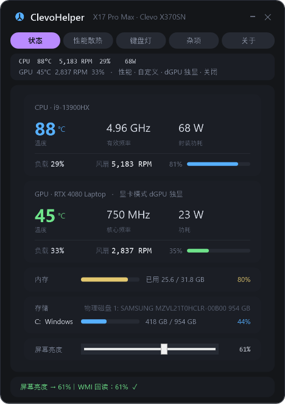
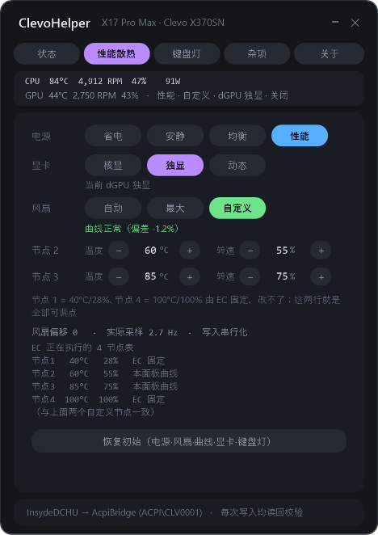
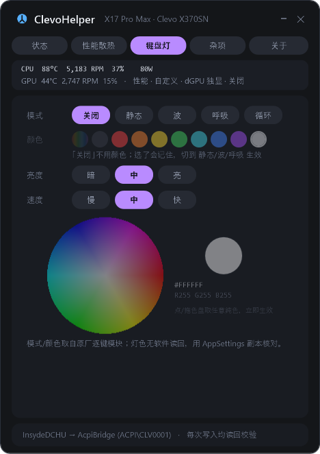
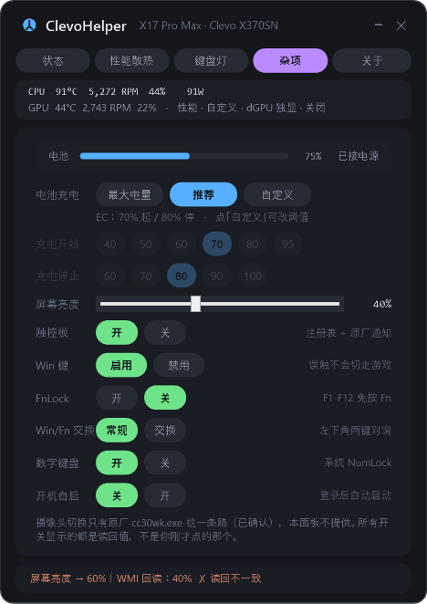

# 蓝天 Clevo X370SN 控制中心（ClevoHelper）

给**七彩虹将星 X17 Pro Max（蓝天 Clevo X370SN 准系统）**做的 G-Helper 风格控制中心 ——
**一个 9.5 MB 的 exe**，免安装，温度/风扇/电源模式/风扇曲线/显卡模式/键盘灯/充电上限全在里面。

> 原厂那套 Control Center 装完是一堆 UWP，开机自启、常驻后台，切个风扇要等它转好几秒，
> 界面还是十年前的风格。这个工具只做"要用的那几件事"，而且**每一件都写进去再从硬件读回来核对**。
>
> 它**不装第三方驱动、不直接碰 EC 端口、不用被微软封杀的 `inpoutx64`/`WinRing0`** ——
> 走的全是原厂自己那条签名通道：`InsydeDCHU.dll` → `AcpiBridge.sys`（`ACPI\CLV0001` / `CLV0002`）。

---

## 它解决什么问题

- **风扇太吵 / 想安静**：电源模式一键切（省电·安静·均衡·性能），风扇还能自己拉曲线（两个可调节点，按 5 调，配置会记住）。
- **打游戏想满血**：显卡模式切「独显」、风扇切「最大」。
- **合盖带去图书馆想省电**：显卡模式切「动态」/「核显」，充电限制 70-80% 护电池。
- **键盘灯**：关闭 / 静态 / 波动 / 呼吸 / 循环，颜色可以从色盘上取任意纯色（原厂逐键 RGB 模块）。
- **改一次就记住**：你在面板里的选择（键盘灯 / 风扇曲线与模式 / 电源模式 / 充电窗口）都存在 settings.json，**下次开机自动注入回去** —— 键盘灯是硬件断电就忘的东西，不注入它每次开机都是灭的。
- **只想看温度**：状态页，不点任何按钮，纯监控。

---

## 下载与安装

到本仓库的 **Releases** 页面下载最新那个 `ClevoHelper-vX.Y.exe`（文件名带版本号）：

| | |
|---|---|
| 免安装 | 双击就跑；第一次运行会把自己解包到 `%LOCALAPPDATA%\ClevoHelper\` |
| 无依赖 | 脚本、DCHU 库、驱动包全在 exe 里（所以有 9.5 MB） |
| 权限 | **不需要管理员**（只有"重装 DCHU 驱动"那一个功能会弹 UAC） |
| 开机自启 | 面板里点「开机自启 → 开」，登录后静默进托盘 |

> **先决条件是那台机器**：蓝天 Clevo X370SN 准系统（七彩虹将星 X17 Pro Max 等贴牌）。
> 别的 Clevo 机型**不保证能用**：所有命令字、字节布局都是在这台机器上一项项实测出来的（见[开发笔记](开发笔记.md)）。

### 下载后被 Windows 拦住了？（SmartScreen「已保护你的电脑」）

会。因为这个 exe **没有代码签名证书**，而且浏览器给下载的文件打了一个"来自 Internet"的标记，
SmartScreen 于是弹「Windows 已保护你的电脑 —— Microsoft Defender SmartScreen 阻止了无法识别的应用启动」，
按钮还只有「不运行」。

**这不是杀毒引擎报毒**（Defender 的引擎从没把这个 exe 判成威胁），只是"这个发布者我不认识"。
三种放行办法，任选一种：

1. **在弹窗里**：点「更多信息」→ 下面会出现「仍要运行」。
2. **先解锁再双击**：右键 exe → 属性 → 勾上「解除锁定」→ 确定。
3. **命令解锁**（等价于第 2 条）：
   ```powershell
   Unblock-File -Path "$env:USERPROFILE\Downloads\ClevoHelper-v1.2.exe"
   ```

想确认下载的文件没被掉包，可以先对哈希（`v1.2` 发布附件 `ClevoHelper-v1.2.exe` 的 SHA256，
就是 Releases 页面里那个附件摘要）：

```powershell
(Get-FileHash "$env:USERPROFILE\Downloads\ClevoHelper-v1.2.exe" -Algorithm SHA256).Hash.ToLower()
# 9f91da6f705ca4d7085a53cd3f68687c078422a1d8597cc92a9d8fa10827c1d6
```

> 注意：**每次重新构建出来的 exe 哈希都不一样**（PE 头里有构建时间戳），所以请以**你下载的那个
> 附件在 Releases 页面显示的摘要**为准 —— 本仓库 `dist\` 下的那份和发布附件是同一份源码编的，
> 但字节不同。

**唯一的"根治"办法是代码签名**（EV/OV 证书，一年几百到几千块），个人小工具通常不做 ——
所以要么按上面放行一次，要么**从源码自己构建**（`src\build-exe.ps1`，本机生成的文件没有那个网络标记，
不会被拦）。程序**不联网**、不写注册表以外的地方，放行前也可以先看[它不做什么](#它不做什么重要)。

---

## 怎么用

五个标签页，从左到右：

| 标签页 | 里面有什么 |
|---|---|
| **状态** | CPU/GPU 温度·风扇·频率·功耗·负载、内存、磁盘、**屏幕亮度** |
| **性能散热** | **电源模式**（省电/安静/均衡/性能）、**显卡模式**（核显/独显/动态，重启生效）、**风扇**（自动/最大/自定义曲线）、[恢复初始] |
| **键盘灯** | 模式（关闭/静态/波动/呼吸/循环）、颜色（预设色块 + 色盘取任意纯色）、亮度、速度 |
| **杂项** | 电池充电上限（最大电量/推荐/自定义）、触控板、Win 键、FnLock、Win/Fn 交换、数字键盘、开机自启 |
| **关于** | 版本、机器、通道状态、作者 |

窗口右上角 `–` 和 `×` **都是收进托盘**（不是退出）。真要退出：托盘右键 → **退出**，或者 `Alt+F4`。

### 截图

| 状态 | 性能散热 |
|---|---|
|  |  |

| 键盘灯 | 杂项 |
|---|---|
|  |  |

<details>
<summary><b>它每一件事具体怎么做的（点开）</b></summary>

**电源模式 / 风扇模式**：走原厂 `SetDCHU_Data(121, {值,0,0,子命令})` + AppSettings 镜像，
写完**从固件读回**那个字节再判定成功（绿色 = 读回一致，橙色 = 不一致）。

**自定义风扇曲线**：EC 的 4 节点表里 节点1（40°C/28%）和 节点4（100°C/100%）是固件固定的，
只有 节点2/3 可写。面板把这两个节点按 5 的倍数调，写进 EC 后**读回 block 13（EC 正在执行的运行时表）**核对。
你调的那份存在 `settings.json` 里，重启面板还在；启动时如果 EC 跑的不是你这套（且当前是「自定义」模式），
面板会按你的配置写回去。

**显卡模式**：`SetWMIPackageEx(4, {0x16, mode, …})`，逐字节来自原厂 `ControlCenter30.exe` 的 IL。
这是**开机前（pre-boot）值**，线上没有任何通道能读回"已暂存未重启"，所以面板只**暂存**并弹一张
「重启申请」（立即重启 / 稍后我自己重启），**绝不替你重启**（原厂是直接 `shutdown -f -r -t 0`）。

**键盘灯**：`HID` 直接发原厂逐键帧（`048D:8910`，report id `0xCC`）。模式/颜色/亮度/速度全部取自原厂
模块的帧常量。**灯色没有任何软件读回**——发出去就发出去了，颜色对不对只能看灯。

**电池充电上限**：FlexiCharger，`{0x1F, enable, start%, stop%}`；可选的起止电量**由 EC 自己报**
（本机是起 40/50/60/70/80/95、停 60/70/80/90/100），面板不自己编数字。

**屏幕亮度 / 触控板 / 数字键盘**：这三个不走 DCHU（WMI / 注册表 / 键盘状态），是面板另外加的。

</details>

---

## 它不做什么（重要）

- **不替你重启**。显卡模式、驱动重装这类需要重启的事，面板只申请，点不点你决定。
- **不写 BIOS、不刷固件、不碰 EC 端口**，只用原厂签名通道。
- **不联网**。没有遥测、没有账号、没有任何数据上传（你可以用防火墙把它的出网全掐了，功能不受影响）。
- **不装第三方内核驱动**（不用 `inpoutx64` / `WinRing0` / `NTPort`）。
- **不做原厂没做过的事**。摄像头切换、Fn 组合键的 OSD 这些只有原厂 `cc30wk.exe`/`FnKey.exe` 那条路，
  本面板不提供，也不假装提供。

---

## 从源码构建 / 开发模式

不需要 Visual Studio、不需要 .NET SDK —— 只用系统自带的 `csc.exe`：

```powershell
# 打包成单文件 exe（会顺便把 exe 部署到 %LOCALAPPDATA%\ClevoHelper 并刷新快捷方式/自启）
powershell -NoProfile -ExecutionPolicy Bypass -File .\src\build-exe.ps1

# 开发模式：不打包，直接跑脚本（需要 src\lib\InsydeDCHU.dll，见下）
powershell -STA -NoProfile -ExecutionPolicy Bypass -File .\src\ClevoHelper.ps1
```

自检（会真的点按钮、真的写入再读回，最后还原；带 `-SelfTest` 时窗口会显示出来）：

```powershell
powershell -STA -NoProfile -ExecutionPolicy Bypass -File .\src\ClevoHelper.ps1 -SelfTest
```

这些自检不是摆设，它们抓出过真 bug：绑定被删（按钮画出来但没接事件）、`GetNewClosure()` 里的作用域陷阱
（确认了但一条命令都没发）、`Hide()` 会把 `ShowDialog()` 结束掉（最小化变成退出程序）。
细节都在[开发笔记](开发笔记.md)里。

---

## 仓库结构

```
src\
  ClevoHelper.ps1        面板本体（WPF，XAML 在脚本里；状态页/性能页/键盘灯/杂项/关于）
  dchu.ps1               原厂通道封装：读遥测、风扇表、电源模式、FlexiCharger、显卡模式
  fancurve.ps1 fanctl.ps1 风扇曲线：帧构造、限幅、斜率、写回读回
  kbled.ps1              键盘灯：HID 帧（模式/逐键颜色/亮度/速度）
  gpu.ps1                GPU 遥测（进程内 NVML，nvidia-smi 只作兜底）
  misc.ps1               屏幕亮度 / 触控板 / 数字键盘（非 DCHU 那几条）
  autostart.ps1          开机自启（装一份副本 + 写 Startup 快捷方式）
  build-exe.ps1          打包单文件 exe（csc + 资源内嵌 + 多尺寸图标）
  Install-ClevoHelper.ps1 部署到 %LOCALAPPDATA% 并刷新快捷方式/AUMID/自启指向
  Install-DchuDriver.ps1 装/修自带的 ACPI 桥驱动包（要管理员）
  Set-ShortcutIdentity.ps1 任务栏/开始菜单身份（AppUserModelID + 快捷方式）
  Remove-FactoryLeftovers.ps1 清原厂残留（默认 dry-run）
  diag-*.ps1             一堆诊断/量测脚本（自检抓 bug 用的那套工具都在这儿）
  lib\InsydeDCHU.dll     原厂 DCHU 库（见下）
  driver\                原厂 ACPI 桥驱动包（见下）
docs\                    截图
使用说明.md               每一项功能怎么用（面向使用者，含"我动了你机器什么"）
开发笔记.md               开发记录：逆向过程、实测数据、踩过的坑与纠正
```

---

## 关于随仓库附带的厂商文件

`src\lib\InsydeDCHU.dll`（2.4 MB）和 `src\driver\`（18 个文件，6.4 MB：`AcpiBridge.sys`、
`DCHUService.exe`、`GetProductdll.dll`、`AMDRyzenMasterDriver.sys` 等）**是原厂的闭源二进制**，
不是本项目的代码，版权属于 Clevo / Insyde / AMD。放在这里只是为了让工具能直接跑起来
（打包脚本会把这些一起嵌进 exe）。

- 只用 MIT 授权的话，**这些文件不在 MIT 范围内**（见 [LICENSE](LICENSE)）。
- 不想用仓库里这份，也可以删掉 `src\lib\` 和 `src\driver\`：面板会在这些位置自动找原厂的库
  （`C:\Program Files (x86)\ControlCenter\...`、`System32\DriverStore\FileRepository\acpibridge1.inf_amd64_*\`），
  装了原厂驱动的机器一样能用，只是打包出来的 exe 就不再"自带"它们了。

---

## 已知限制

- **只在这一台机器上验证过**（i9-13900HX / RTX 4080 Laptop / BIOS 1.07.14 / Windows 11 build 26200）。
  换机型、换 BIOS 版本，命令字和字节布局都可能不一样 —— 用之前先只读监控看看数字对不对。
- **键盘灯颜色没有软件读回**，只能看灯；面板里的 `AppSettings` 副本只是镜像。
- **显卡模式的效果只能在重启后观察**（pre-boot 值，原厂也一样）。
- 电源模式/风扇这些写入**都有读回校验**，读回不一致时状态栏会变橙色并写明，不会假装成功。

---

## 许可

代码与文档：[MIT](LICENSE) © 2026 极夜光 (yeguang225@outlook.com)。
随仓库附带的厂商二进制不属于 MIT 范围，见上。
